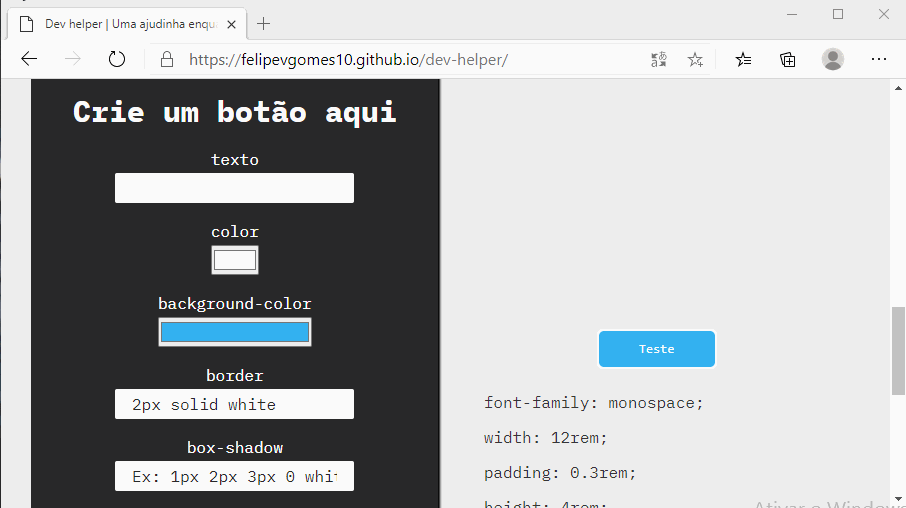
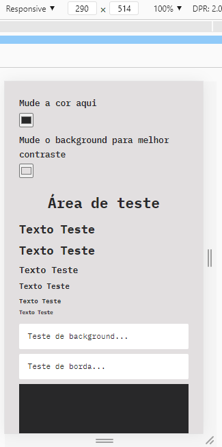
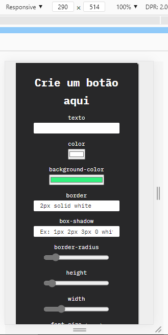
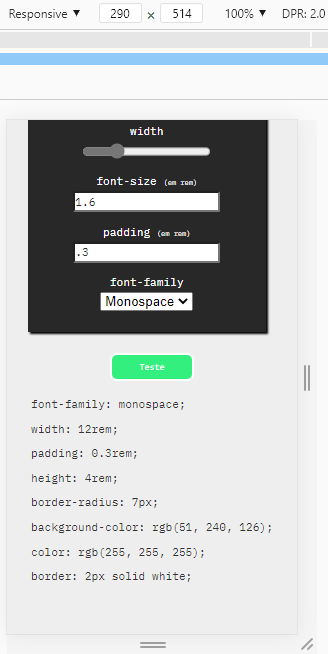

# Dev-helper
Dev-helper é um projeto criado para ajudar pessoas à escolher cores e criar botões estilizados para os seus projetos.

# Para ver o projeto em funcionamento vá para:

https://felipevgomes10.github.io/dev-helper/

# Funcionalidades
Com o dev-helper você pode escolher entre diferentes cores para os seus projetos e ter um **_feedback visual em tempo real_**. Você será **_capaz de testar as cores em bordas, backgrounds, inputs e letras_**.


Além disso, ainda *__é possivel pegar o valor da cor em hexadecial e copiá-lo para ser utilizado nos seus projetos_**.


Além das cores, **_também é possivel criar um botão do zero e estilizá-lo_** para ele ficar do jeito que você quer, tendo também um **_feedback em tempo real do visual do botão e tendo acesso ao código CSS dele_**. É possivel editar:

1. texto interno;
2. cor do texto;
3. background do botão;
4. borda;
5. border-radius;
6. height;
7. width;
8. font-size;
9. padding;
10. font-family.


# Local Storage
A sessão de **_criação do botão foi configurada para guardar as prenferências do botão mais recente_**, sendo assim, você **_não perderá o seu botão caso o seu navegador feche, ou a página seja recarregada_**.



# Inicializando o projeto
O projeto Dev-helper foi criado com a ajuda de tecnologias como **_HTML5, CSS3 e JavaScript_**. Além disso **_foi utilizado o NodeJS_**, sendo assim você precisará instalá-lo no seu computador. Alguns pacotes npm também foram utilizados durante o projeto a fim de automatizar o processo, sendo eles:

1. express;
2. nodemon;
3. live-server;

Para instalar os pacotes basta abrir o seu terminal preferido e executar o seguinte código:

```
npm install
```

# Servidores
Dev-helper **_utiliza um servidor simples criado a partir do NodeJS e do pacote npm ExpresssJS_**. Com a ajuda de outro pacote chamado nodemon, é possível abrir a porta do servidor na máquina e deixá-la em estado de monitoramento, dessa forma o servidor irá reiniciar automáticamente após alterações, você só precisará recarregar a página. O comando para iniciar o servidor do express é (deve ser executado com o terminal aberto na pasta do projeto):

```
npm run server
```

Obs: No começo foi utilizado o live-server, mas como os arquivos estáticos foram movidos para a pasta public, o live-server tornou-se inutilizável, assim, sempre execute o servidor do express com o comando acima.

# Responsividade
**_Dev-helper faz uso do CSS flex-box_**, e é **_totalmente responsivo_** para todos os tamanhos de tela.

  


